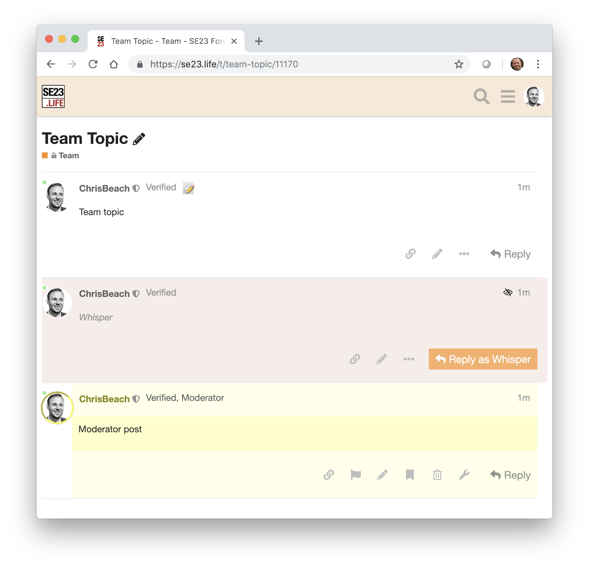

# discourse-team-tweaks

Theme for [Discourse](https://meta.discourse.org) forums:
 
 * Team categories have a light orange header colour
 * Whispers have a light orange background colour
 * Whisper reply buttons coloured orange and labelled with "reply as whisper" to distinguish from regular reply buttons
 * When posting as moderator, avatar is shown with gold ring, and ", moderator" is added to title   

### Installation

1. Admin > Customize > Themes > Import > From the web
2. Type: https://github.com/chrisbeach/discourse-team-tweaks
4. Select your current theme (it's indicated with a star)
5. Under "Theme Components," select "Team Tweaks" and click "Add"

### In use at:

* [SE23.life](https://se23.life)
* [SE26.life](https://se26.life)
* [SE6.life](https://se6.life)

### License 
Apache 2.0

